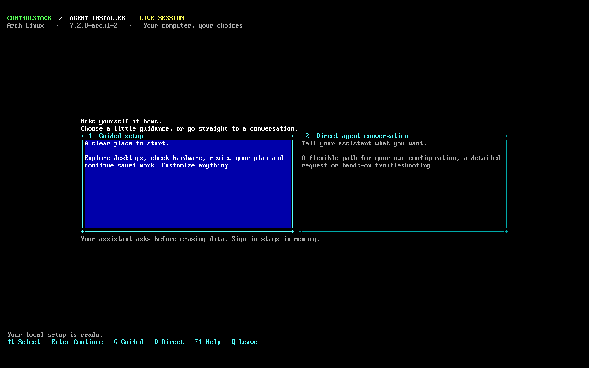

# Agent Installer

A Linux installer with an assistant running on the computer you are setting up.
Boot from USB, connect to the internet, sign in to Codex, and explain what you
want in ordinary language. You do not need to relay terminal output to an agent
on another device.

Choose **Guided setup** for editable desktop presets and a dashboard, or
**Direct agent conversation** to start by talking. Both use the same assistant
and connection checks.



**Development preview:** Arch Linux and NixOS live images are available for
Intel/AMD x86_64 computers. Their live environment and interface have passed VM
tests. A complete physical-disk installation, booting the installed system,
and recovery have not yet been validated. The assistant can run real system
commands: review its disk and data-preservation plan before authorizing changes.
Choosing a preset does not authorize erasing a disk.

## Try it

You need a compatible computer, a USB drive with room for the image, internet
access, and a ChatGPT account with Codex access or an OpenAI API key. Device-code
sign-in is easiest with a phone or another computer nearby. Apple Silicon and
other ARM computers are not supported by the current images. Secure Boot has
not been validated.

### 1. Download a live image

| Image | Download and test results |
| --- | --- |
| Arch Linux | [Download artifact](https://github.com/ControlStackAI/agent-installer/actions/runs/37827953315/artifacts/11572028879) · [Passing build](https://github.com/ControlStackAI/agent-installer/actions/runs/37827953315) |
| NixOS | [Download artifact](https://github.com/ControlStackAI/agent-installer/actions/runs/37827958787/artifacts/11573385102) · [Passing build](https://github.com/ControlStackAI/agent-installer/actions/runs/37827958787) |

Download the artifact ZIP and extract it. Alternatively, open the passing build,
scroll to **Artifacts**, and select its `agent-arch-*` or `agent-nixos-*` entry.
Use the `.iso` inside. `SHA256SUMS`
identifies the exact image; JSON receipts and screenshots show what was tested.

GitHub requires sign-in to download Actions artifacts. These downloads expire
after 14 days. After expiry, [build from source](#build-from-source) or run the
**Build and boot live image** workflow in your fork. The release named
`build-inputs-2026-10-05` contains build dependencies, not an installer image.

### 2. Put it on USB and boot

- **Already using Ventoy?** Copy the extracted `.iso` onto its main partition,
  safely eject the USB, and select that image from Ventoy's boot menu.
- **Using a spare USB?** [balenaEtcher](https://etcher.balena.io/) works on Windows,
  macOS, and Linux. Select the ISO, select the spare USB, and flash it. This
  replaces the contents of that USB drive.

Restart the computer, select the USB from its firmware boot menu, and choose
the default live entry. The welcome screen opens automatically on the first
console. If you reach a command prompt, type `agent-installer` and press Enter.

### 3. Choose how to begin

| Path | What happens |
| --- | --- |
| **Guided setup** | Browse presets, edit choices, inspect hardware, review a plan, or prepare recovery and continuation notes. Press **A** to talk to the assistant. |
| **Direct agent conversation** | Go straight to connection setup and sign-in, then describe your goal. You can still ask for presets or change every choice. |

Use arrow keys and Enter on the welcome screen. In the dashboard, **1–8** changes
pages, **N** opens network setup, **A** opens the assistant, **?** shows help,
and **Q** returns to a shell. Network setup and conversation temporarily use
the full terminal; the dashboard returns when you exit them.

### 4. Connect and sign in

The installer checks Ethernet or an existing connection and offers Wi-Fi setup
through NetworkManager. Internet access, a synchronized clock, and matching
live ZFS support must be ready before sign-in or starting Codex.

Choose one of the native Codex sign-in methods:

- **ChatGPT subscription, device code:** follow the displayed instructions on
  your phone or another computer. Recommended for a live console.
- **ChatGPT subscription, browser:** use browser sign-in when convenient.
- **OpenAI API key:** enter the key in the hidden-input prompt. API usage is
  billed separately from a ChatGPT subscription.

Successful sign-in starts the assistant in the same flow. Credentials stay in
private RAM storage and disappear when the live system reboots.

### 5. Tell the assistant what you want

You can start with:

> I'm new to Linux. Help me choose a desktop, inspect this computer, and explain
> the installation plan before changing anything.

Or be specific:

> I want Arch with ZFS and my own Hyprland configuration. Inspect the hardware,
> preserve my existing data, and show me a disk plan to review.

The assistant can inspect the computer directly. It knows which live
distribution it is in and must recheck its environment after changing roots
or rebooting. Explain which data you need to keep before approving a plan.

## Presets help you start; you control the result

| Starting point | Intended experience |
| --- | --- |
| Familiar desktop | KDE Plasma, with a traditional application menu, taskbar, and settings. |
| Simple desktop | GNOME, with a focused desktop experience. |
| Hyprland with Quickshell | A tiling desktop, three floating bar sections, and an icon-based search launcher. |
| Minimal or server | A system without a graphical desktop. |
| Start from your own choices | Begin without a selected desktop or filesystem and describe your own setup. |

These are plans for the assistant to build, not desktops preinstalled in the live
image. Every choice is editable. Advanced users can supply their own configuration,
choose an unlisted desktop or filesystem, or edit the complete choices record with
**E**. The assistant checks the requested combination against the distribution
and hardware; presets do not define a closed list of allowed setups.

The supplied desktop/server presets start with **ZFS** and the newest released
kernel compatible with the selected ZFS version. Image inputs are pinned, so a
rebuild uses reviewed versions rather than silently upgrading them.

## Rebooting, resuming, and recovery

The live system is temporary. Choices and notes remain in RAM unless you save
them. Before rebooting, use **Reboot handoff** or ask the assistant to save a
reviewed continuation file to storage you choose.

The handoff contains only a validated, non-secret JSON record. Review the
destination and contents, then explicitly confirm saving. Existing files are
never overwritten. Credentials and conversation histories are not exported.
On a later live boot, import the handoff and sign in again. The assistant must
recheck hardware, verification results, and disk permissions; old notes are
context, not approval to erase anything.

For recovery, start with:

> This computer stopped booting. Inspect it without changing disks and explain
> what you find before proposing repairs.

Recovery starts read-only. Selecting the Recovery page does not run a repair or
import a pool. Saving a handoff does not install a permanent operating-system
agent; the resident OpenClaw agent is a separate project.

## If something goes wrong

| Problem | Next step |
| --- | --- |
| No welcome screen | At the live command prompt, run `agent-installer`. |
| No internet | Press **N** in the dashboard, or choose connection setup in the direct flow. Check Wi-Fi or Ethernet, then retry. |
| Clock or readiness check fails | Connect first, allow time synchronization, and retry. Sign-in remains unavailable until the checks pass. |
| Device-code sign-in fails | Follow the native Codex instructions and try again; account access may need attention. Never publish a sign-in code or API key. |
| Interface does not display correctly | Run `agent-installer --text` for the basic console, or `agent-installer --direct` for the assistant setup flow. |
| Need a shell | Press **Q** to leave the dashboard. The basic connection/sign-in flow also offers a troubleshooting shell. |

[Report a problem](https://github.com/ControlStackAI/agent-installer/issues)
with what you tried, what happened, and the image name or checksum if available.
Describe it in your own words; you do not need to understand Linux commands.
Do not include passwords, API keys, sign-in codes, or private conversation history.

## What has been tested

The recorded Arch and NixOS images passed BIOS and UEFI VM boots, network/time
readiness checks, and real ZFS snapshot rollback and full/incremental send/receive
on temporary file-backed pools. Separate ordinary offline boots exercised the
welcome screen, presets, editable choices, guided/direct handoffs, connection
gating, and return to the dashboard. Source checks include 62 Python and Rust tests.

These VM checks attach no host disks. They do not prove a completed target-disk
installation, root-on-ZFS boot, physical USB boot, or a real account/model session
for these image bytes. See [exact hashes and verification boundaries](docs/verification.md).

## Build from source

For contributors and users who want to rebuild or customize an image:

- An x86_64 Linux build host and Python 3.11+.
- **Arch:** Docker. The builder supplies its Rust compiler in an isolated container.
- **NixOS:** Nix with flakes enabled. Nix builds the Rust frontend natively.
- Disk space for the ISO, extracted root, package caches, and build staging.
  Building needs substantially more space than downloading an ISO.

```sh
git clone https://github.com/ControlStackAI/agent-installer.git
cd agent-installer
python3 scripts/check.py
```

Choose the image to build:

```sh
python3 scripts/build.py --distro arch --jobs 2
# Or:
python3 scripts/build.py --distro nixos --jobs 2
```

Results are written to `dist/<distro>/`. Inputs and dependency checksums are
locked. Follow [CONTRIBUTING.md](CONTRIBUTING.md) for deliberate version updates;
changing inputs requires new image tests. Arch checks upstream signatures and
released kernel/ZFS compatibility. Containers receive only public project
sources and disposable caches, with no operator home, credentials, or host disks.

For the frontend's Rust tests, install a compatible Rust toolchain and run:

```sh
CARGO_TARGET_DIR="$PWD/.build/tui-target" cargo test --locked --manifest-path frontends/ratatui/Cargo.toml
```

To inspect the interface without running system actions, use the built
`agent-installer-tui --preview`. See [terminal interface development](docs/terminal-interface.md)
for rendering examples. [Verification](docs/verification.md) covers isolated VM
checks, which also require QEMU, Tesseract, and OVMF for UEFI.

## Extend it to another distribution

The shared workflow is separate from distribution-specific image building and
installation guidance:

| Location | Responsibility |
| --- | --- |
| `core/` | Shared onboarding, readiness, environment detection, and support tools. |
| `frontends/ratatui/` | Guided terminal interface over the shared tools. |
| `identity/` | Beginner-friendly installer role and data-preservation workflow. |
| `profiles/` | Distribution facts, agent guidance, and declared capabilities. |
| `presets/` | Editable starting choices. |
| `runtimes/codex/` | Native Codex sign-in, launch, and pinned runtime inputs. |
| `adapters/` | Native Arch and NixOS image builders. |

New distributions add a profile and native adapter while reusing the shared
workflow. Document and test each adapter's actual capabilities. The NixOS module
can also be imported into another custom live-image flake. Start with the
[architecture and extension contract](docs/architecture.md) and
[agent-directed workflow](docs/agent-directed-workflow.md).

## Roadmap

- **More distributions, potentially any Linux distribution:** add native image
  builders and profiles, with installation and recovery capabilities tested
  separately for each distribution.
- **A graphical installation option:** make connection setup, conversation,
  choices, and disk-plan review easier for beginners while keeping direct
  conversation and advanced customization available.
- **Complete installation qualification:** test disposable target-disk installs,
  booting after removing the ISO, rollback, and recovery before claiming those
  paths are supported.

The current interface is a terminal UI. A graphical installer and broader
distribution coverage remain future work.

## Contributing and license

Contributions and beginner feedback are welcome. Read
[CONTRIBUTING.md](CONTRIBUTING.md) and [AGENTS.md](AGENTS.md) before changing code.

Project source is [Apache-2.0](LICENSE). Third-party packages and image contents
retain their own licenses; see [provenance and notices](docs/third-party.md).
Agent Installer is independent of OpenAI, Arch Linux, NixOS, and OpenClaw and
does not imply their endorsement.
